<!-- ═══════════════════════════════════════════════════════════════ -->
<!-- Hero: ASCII portrait (left) + Neofetch info card (right)       -->
<!-- ═══════════════════════════════════════════════════════════════ -->
<table>
<tr>
<td valign="top"></td>
<td valign="top"></td>
</tr>
</table>

## Kunal Kaushal

**GenAI Developer · RAG Pipelines · Multi-Agent Systems**

[Portfolio](https://kunalkaushal.tech) · [LinkedIn](https://www.linkedin.com/in/kunal-kaushal-a95479299/) · [LeetCode](https://leetcode.com/u/kunal_921/) · [Email](mailto:kunalkaushal921h@gmail.com)

 

<!-- ═══════════════════════════════════════════════════════════════ -->
<!-- GitHub Stats                                                    -->
<!-- ═══════════════════════════════════════════════════════════════ -->

 

 

  

<!-- ═══════════════════════════════════════════════════════════════ -->
<!-- Contribution Heatmap — regenerated daily by GitHub Actions      -->
<!-- ═══════════════════════════════════════════════════════════════ -->

